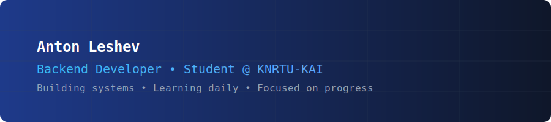

  

<h3 align="center">👨‍💻 Bio</h3>

🚀 **Backend Developer (1st Year, IVT)**  
Go • Python • C++ • Kafka • Docker • Postgresql

🔧 Building real shit, not tutorials.  
🎯 Solving problems nobody asked for.  
🦆 Debugging with rubber duck — because I don’t need your validation.  
♟️ Playing chess. Not for wins—for the silence before collapse.
🙏 Yandex.Lyceum? Yeah. You taught me how to code.  
Now go away. I’m busy.  
— And I’m not forgetting you.

---

<h3 align="center">🌐 Reach Me</h3>

---

<h3 align="center">🛠️ Tech Stack</h3>

 

---

<h3 align="center">🎯 Projects</h3>

| PROJECT                                                       | DESCRIPTION                                                                                                                                                                                        |                            TECH STACK                            |
|:--------------------------------------------------------------|----------------------------------------------------------------------------------------------------------------------------------------------------------------------------------------------------|:----------------------------------------------------------------:|
| [calcflow-engine](https://github.com/tainj/calcflow-engine)   | A distributed computation system with microservices architecture for scalable and fault-tolerant processing.                                                                                       |          `Go`, `Kafka`, `Redis`, `PostgreSQL`, `Docker`          |
| [edgebot](https://github.com/tainj/edgebot)                   | A Go-based Telegram bot that applies the Prewitt edge detection algorithm to images. Offers interactive filter selection and works directly in Telegram.                                           |                  `Go`, `gopkg.in/telebot.v4`, `image`            |
| [salespulse](https://github.com/tainj/salespulse)             | A Flask-powered sales analytics dashboard for real-time insights into customer orders, product performance, and revenue trends — built as a freelance project and shared for portfolio purposes.   |  `Python`, `Flask`, `SQLite`, `SQLAlchemy`, `WTForms`, `Plotly`  |

<blockquote>
💡 More projects coming soon — stay tuned! 
</blockquote>

---

<h3 align="center">📊 GitHub Stats</h3>

&nbsp;

